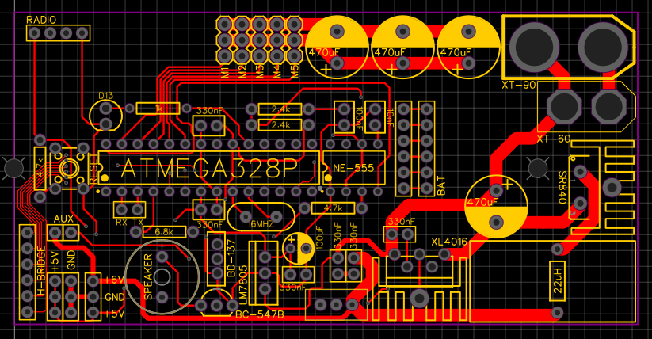
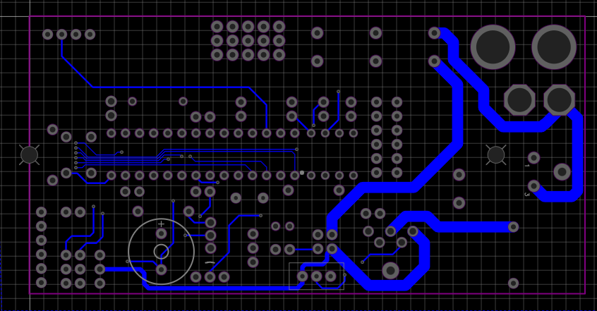
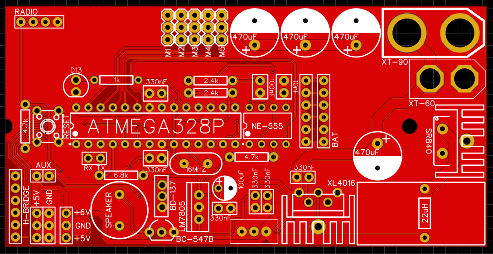
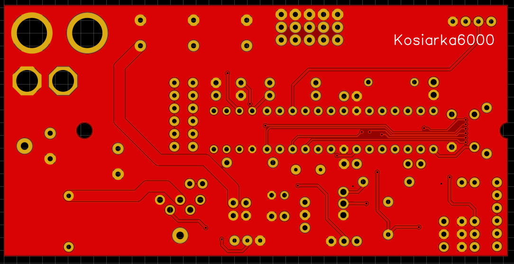
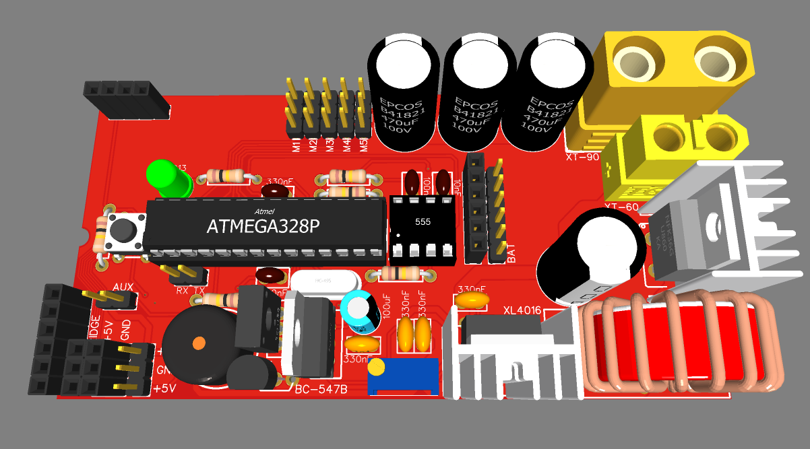

Receiver PCB board using 433MHz cheap RF modules I made back in 2021 for my RC controlled car. Board also consist of onboard voltage conveter utilizing XL4016 IC.

<picture>
 <source media="(prefers-color-scheme: dark)" srcset="RC_Car_2021_Receiver_Front_Copper.PNG">
 <source media="(prefers-color-scheme: light)" srcset="RC_Car_2021_Receiver_Front_Copper.PNG">
 
</picture>

<picture>
 <source media="(prefers-color-scheme: dark)" srcset="RC_Car_2021_Receiver_Back_Copper.PNG">
 <source media="(prefers-color-scheme: light)" srcset="RC_Car_2021_Receiver_Back_Copper.PNG">
 
</picture>

<picture>
 <source media="(prefers-color-scheme: dark)" srcset="RC_Car_2021_Receiver_Front_2D.PNG">
 <source media="(prefers-color-scheme: light)" srcset="RC_Car_2021_Receiver_Front_2D.PNG">
 
</picture>

<picture>
 <source media="(prefers-color-scheme: dark)" srcset="RC_Car_2021_Receiver_Back_2D.PNG">
 <source media="(prefers-color-scheme: light)" srcset="RC_Car_2021_Receiver_Back_2D.PNG">
 
</picture>

<picture>
 <source media="(prefers-color-scheme: dark)" srcset="RC_Car_2021_Receiver_Render.PNG">
 <source media="(prefers-color-scheme: light)" srcset="RC_Car_2021_Receiver_Render.PNG">
 
</picture>
